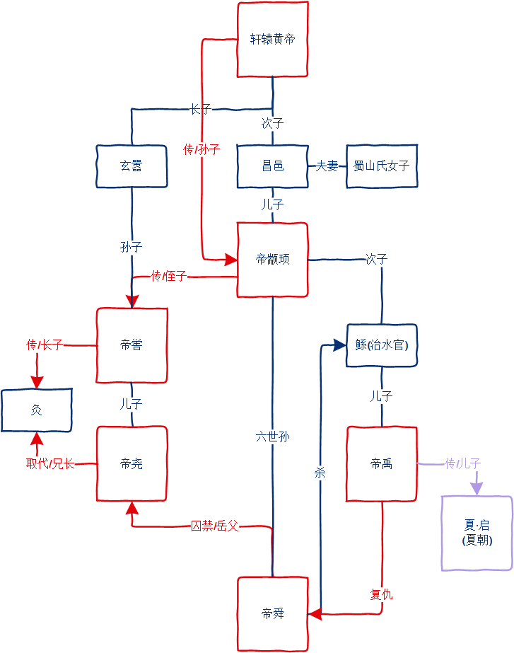

# 你以为的-事实上的
## 禅让制
- 你以为的 
尧、舜、禹 让贤 帝位有德者居之

- 事实上的

夏     印度河·哈拉帕 迁都(公元前17世纪
夏     古蜀·三星堆
黄帝 姬姓
    昌邑(黄帝次子)--蜀山氏女子
    颛顼帝(黄帝孙子)
    禹(黄帝玄孙/四世孙) 出生在西羌(川西北) 古蜀·三星堆  夏始祖

大禹的母亲误食一以的植物生的大禹，舜赐姓，姒
周武王母亲(周文王妻子) 太姒，太姒的婆婆太任，太任的婆婆太姜，三太是最贤德的女人，是太太的由来

帝喾的妃子简蝶吞食玄鸟生的蛋生儿子弃，弃是商朝的始祖

## 水的形态
- 你以为的
气态、液态、固态 很稳定 0度结冰，100度水蒸气

- 事实上的
水0度结冰100度蒸发是在一个标准大气压的理想状态下实现的
低于0度不一定结冰，过冷水, 但低于-48度一定结冰
过冷水打破平衡会瞬间结冰，跟0度结的冰不一样，介于固体和液体之间
冰有18种结晶态
水在2000多度高温下能结冰的第18种结晶态-冰18

水在40度到60度之间会发生质的变化，40度以下的水跟60度以上的水完全不是同一种东西
超过60度的水是致癌物质
世界上没有完全一样的雪花
在压力下，超过100度的水蒸气可以液化，但超过临界温度373.99度水蒸气，不能被液化 (压焓图 p-h)
在0度下，熵能满足一定条件，水可以是气体。(温熵图 t-s)

都市传说：
在极端(高温)情况下，水的氢氧键会断裂生成氢气和氧气，氢气和氧气在高温下被点燃，又变成水，形成水的连锁反应爆炸
原子弹爆炸、火山喷发、通古斯大爆炸都可能是水的连锁反应爆炸

## 岳飞之死
- 你以为的
被奸臣秦桧害死

- 事实上的
被当朝天子宋高宗害死的
"笑区区一桧亦何能逢其欲"--文征明的满江红

秦桧 宰相 一品，岳飞 枢密副使 从一品。(宰相与枢密合称宰执大臣，地位是平等的。)
秦桧凭一己之力是害不死岳飞的。

### 宋高宗为何要杀岳飞，以及岳飞必死的原因
- 原因一：宋高宗怕收复中原后，自己的皇位不保。
(靖康之耻，徽、钦二帝被俘，宋高宗才当上的皇帝，如果二圣还朝，他的正统性会受到影响。)
"千古休夸南渡错，当时自怕中原复"--文征明的满江红

刚当皇帝时，喊“收复中原，迎回二圣”是政治正确，等坐稳江山，再喊迎回二圣就是政治不正确了。
你干的事是老板不愿意干的事。

- 原因二：建议宋高宗立储 (更深层原因)
后来岳飞反应过来了，也不再喊迎回二圣了，并做出了他认为正确的补救措施--建议宋高宗立储(立太子)。
岳飞想的是，你都立了太子了，算是生米煮成熟饭了，名正言顺，哪怕二圣回来了，也为时已晚，不能再改变什么。
宋高宗想的是，你建议立建国公为太子(后来的孝宗)是什么意思？ 是觉得我快死了吗，你好讨好储君？还是你私下里跟建国公有勾结，并且我这么多儿子，你干嘛非要立他？ 还有这我家事，你管的着吗？即便是建议立储，那也是文臣的才能干的。 宋高宗同岳飞说，此事卿不当与闻。(你都不该知道这事）
皇帝自己可以立，但你不能建议。 (如同帝王另外一个心态：我可以给，但你不能要。)

- 原因三：犯忌(功高震主+宋朝开国黑历史)--必死
岳家军当时占全国军队的4/7，全国超过一半的兵都是岳飞的。
高宗想的是，这些兵都是你岳家军不是我赵家军，你连金朝都能打败，要是哪天你一翻脸，我怎么边，你不就做皇帝了吗？这事宋朝开国太祖赵匡胤就是这么干的呀，他最怕的就是别人也这么干。自己怎么创业成功的，肯定第一手要防的就是别人也这么创业成功。
所以岳飞一路胜利一路离必死越近。

- 原因四：无法规避风险(完人+无退路)--必死
在皇帝眼中，没有缺点的人是最大的缺点，他没有什么把柄能制衡住你的，只能把你弄死。
高宗召岳飞君臣问对，怎么才能天下太平，岳飞答："文官不爱钱，武官不惜死，不患天下不太平"，高宗很高兴才赐与岳飞"精忠岳飞"的锦旗，岳飞是这么说的，也是这么做的。
岳飞没有物欲，没有权力欲，皇上想办他，没有借口。又得用他打仗，又拿他没办法，心中只能恨。
岳飞想不到的是，他清白做人会是他最大的问题。
规避风险的方式--自污(萧何通过自污来规避刘邦的猜忌)，岳母刻字"尽忠报国"决定他看中气节不可能自污，高宗为了收买岳飞在杭州给他置产业，岳飞学霍去病"匈奴未灭何以家为"也不要，而且岳飞太年轻，即使他愿意选择另外一个规避风险的方式--退隐(告老还乡)，皇帝也放心不下，因为等把皇帝熬死，他再出山都没多大。 因此他没有退路，无法避祸。
最终皇帝只能授意秦桧以莫须有的罪名把他下狱。
